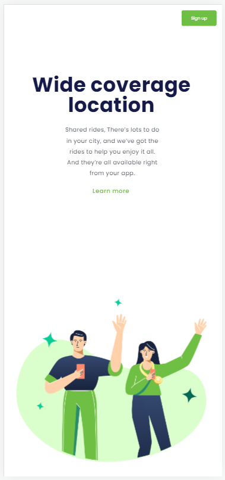

# Wide Coverage

Nesse projeto adquiri conhecimento em alinhar elementos e responsividade utilizando CSS

O projeto está disponível para os sócios do <a href="https://rodolfomori.com.br/devclub/"> DevClub </a>

Técnologias utilizadas:
- HTML
- CSS

